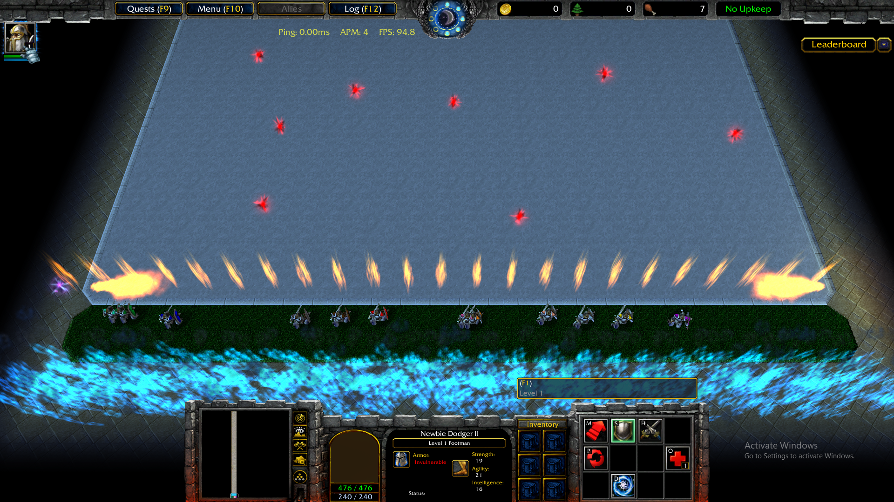
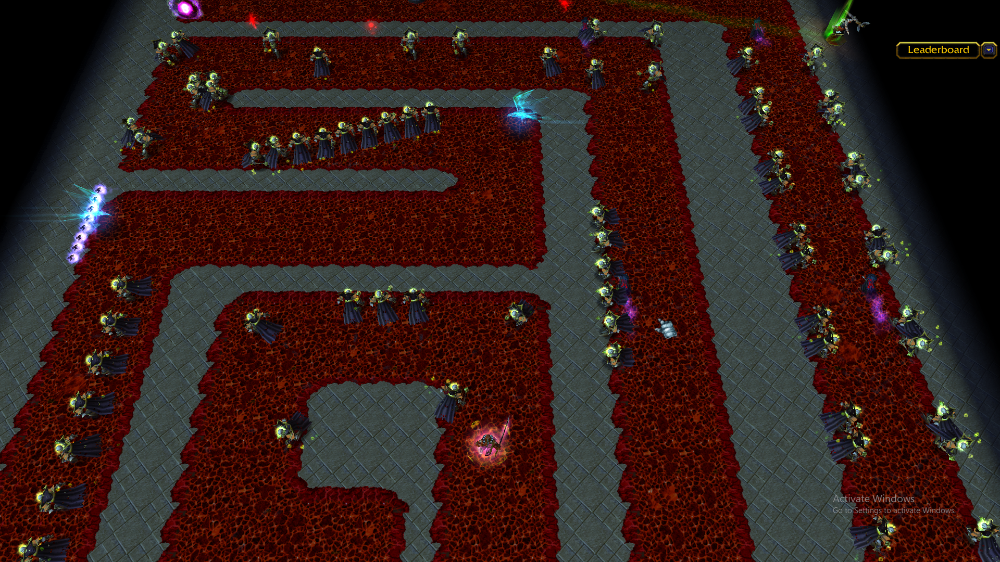

# Dodge Baby Dodge

**A team-based dodging game built on the Warcraft III engine. Five lanes, one spreading fire, and no room for mistakes.**

Dodge Baby Dodge is a Warcraft III custom map: a completely new game, built in the Warcraft III World Editor and running on the Warcraft III engine. Each player controls a single character with the mouse and has to weave through enemy units, projectiles, and spells while racing a fire that spreads through the map behind them. Across five increasingly difficult lanes, it's designed for experienced, highly skilled teams and tests the limits of reaction time, precision, and coordination.

| | |
|---|---|
| **Genre** | Team-based hand-eye coordination / dodging |
| **Platform** | Warcraft III (custom map) - The Frozen Throne v3.0.0.24268 recommended |
| **Players** | Team-based with at least 8 players recommended |
| **Structure** | 5 lanes of escalating difficulty |
| **Controls** | Mouse and keyboard |
| **First public release** | v1.0, 27 March 2025 |
| **Latest version** | v3.1, 25 July 2026 |

## Contents

- [What is a Warcraft III custom map?](#what-is-a-warcraft-iii-custom-map)
- [Gameplay](#gameplay)
- [How to play](#how-to-play)
- [Development history](#development-history)
- [About this repository](#about-this-repository)
- [Feedback and bug reports](#feedback-and-bug-reports)
- [Credits](#credits)
- [Disclaimer](#disclaimer)

## What is a Warcraft III custom map?

Warcraft III ships with the World Editor, a tool that lets players build their own content on top of the game's engine. Custom maps range from small twists on the original strategy game to entirely new genres. Defense of the Ancients (DotA), the map that gave rise to the MOBA genre, started life as one.

Dodge Baby Dodge belongs firmly in the second group. There's no base building, no army to command, and no resources to gather. What remains is the engine itself (its units, spells, and pathing), repurposed into a precision dodging game. Because it's built inside Warcraft III, it can only be played through Warcraft III.

## Gameplay

### The goal

Get your team through all five lanes before the fire catches up. The fire spreads steadily through the map, so there's no waiting around for a safe opening: you have to keep pushing forward while everything around you is trying to hit you.

### Controls

Each player controls a single character, and movement is entirely mouse-driven. Right clicks command characters to move, while keyboard commands such as "W", "D", or "ESC" make the players' character faster, slide, and lock camera - respectively.

### What you're dodging

Threats come in three broad forms: enemy units, projectiles, and spells. Each lane raises the pressure, demanding faster reactions, tighter movement, and better reading of what's coming next, all while the fire keeps closing in.

### Five lanes

The game is split into five lanes, each harder than the last, with Lane 5 as the almost impossible final test. Along the way, teams face distinctive challanges such as darkness, colourful mayhem, team separations, opening gates, and battling through the pits of hell in the last lane.

### Built for teams

Dodge Baby Dodge is designed for very experienced and skillful teams, and it doesn't hold back. Players can resurrect their fallen allies by colliding with Revival Circles and so the more players are in a lobby, the better the chances of a team progressing through the lanes. If you're new to dodging maps, expect a steep learning curve. That's the point.

## How to play

### Requirements

You'll need the latest version of Warcraft III The Frozen Throne (Classic or Reforged doesn't matter) and at least a couple of friends to play with (although players can also play the game alone, this would be more for practice purposes as the game is not designed to be beatable as a lone player.

### Installing the map

1. **Download the map.** Open [`Dodge Baby Dodge.w3x`](Dodge%20Baby%20Dodge.w3x) in this repository and click the download button (*Download raw file*).
2. **Move it into your maps folder.** On Windows this is usually `Documents\Warcraft III\Maps`. You can put it in a subfolder if you like.
3. **Host a game.** Launch Warcraft III, go to **Custom Games**, create a new game, and select *Dodge Baby Dodge* from the map list.
4. **Invite your team** and start the game.

### Playing an older version

Every milestone version is tagged in this repository. To play a specific version, open the [Tags](../../tags) page, choose the version, and download the map file from there.

## Development history

Dodge Baby Dodge began in August 2023 and went through 17 saved milestone versions on its way to where it is today.

**Early development (2023 to early 2025).** The project started as a classic `.w3m` map before moving to the `.w3x` format, and was developed on and off through 2023 and 2024.

**Building the lanes (February to March 2025).** Most of the game came together in an intensive stretch of about a month. The first lane was completed on 24 February 2025, and all five lanes, full multiplayer support, and a round of bug fixing followed, leading to the first public release on 27 March 2025.

**Post-release support (2026).** Later updates focused on stability and polish: fixing a multiplayer desync error (where players' games fall out of step with each other, causing disconnections), an invulnerability bug, and issues in Lane 5, alongside performance improvements.

| Version | Date | Milestone |
|---|---|---|
| v0.0 | 28 Aug 2023 | Initial version |
| v0.1 | 17 Nov 2023 | Early development |
| v0.2 | 5 Feb 2025 | Early development |
| v0.3 | 24 Feb 2025 | First lane complete |
| v0.4 | 27 Feb 2025 | Lanes 2 and 3 complete |
| v0.5 | 4 Mar 2025 | Zeppelins complete |
| v0.6 | 9 Mar 2025 | First 4 lanes and start of Lane 5 complete |
| v0.7 | 12 Mar 2025 | Bird section complete |
| v0.8 | 15 Mar 2025 | Gargs complete |
| v0.9 | 15 Mar 2025 | Reverse complete |
| v0.91 | 20 Mar 2025 | All lanes complete |
| v0.92 | 20 Mar 2025 | All players complete |
| v0.93 | 24 Mar 2025 | All known bugs fixed |
| **v1.0** | **27 Mar 2025** | **First public version** |
| v2.4 | 17 May 2026 | Major bug fixes, including desync error |
| v2.7 | 8 Jun 2026 | Major bug fixes, including invulnerability bug |
| v3.1 | 25 Jul 2026 | Major bug fixes, including Lane 5 bugs and performance |

## About this repository

The repository contains a single file, `Dodge Baby Dodge.w3x`, which is always the latest version of the map. Its full development history lives in the commit log, with each milestone tagged by version number.

The history was reconstructed from the original saved versions of the map, so each commit carries the date and time that version was actually saved. The project began as a `.w3m` file (the original Warcraft III: Reign of Chaos format) and switched to `.w3x` (The Frozen Throne format) from v0.1 onwards.

Warcraft III maps are binary files, so GitHub can't show line-by-line changes between versions. The commit messages and the table above describe what changed in each one. To explore how the map is built, open it in the Warcraft III World Editor.

## Feedback and bug reports

Found a bug or have a suggestion? Please [open an issue](../../issues). It helps to include the map version, the lane or section where it happened, and a short description of what went wrong. If you have a replay, zip it and attach it to the issue.

## Credits

Created by [szoliwer](https://github.com/szoliwer) AKA nomordarkwars with major contributions from WRDA and playtested by Clan 100/101

## Disclaimer

Warcraft is a trademark of Blizzard Entertainment, Inc. Dodge Baby Dodge is an independent, fan-made custom map and is not affiliated with or endorsed by Blizzard Entertainment. A copy of Warcraft III is required to play.
